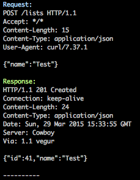

# HI: HTTP Inspector

Provide instant inspector for your *PRIVATE* Web APIs



## Installation

```
$ go get github.com/yuya-takeyama/hi
```

## Usage

### Launch `hi`

```
$ hi -port 8080
```

### Replace API

*NEVER DO THIS FOR PRODUCTION*

```
# Some configuration has API endpoint URL
# YourApiClient.endpoint = "http://api.example.com"
YourApiClient.endpoint = "http://192.168.1.10:8080/proxy/api.example.com"
```

### Inspect

Make some interaction using the API, you'll see it in your terminal.

## Author

Yuya Takeyama
